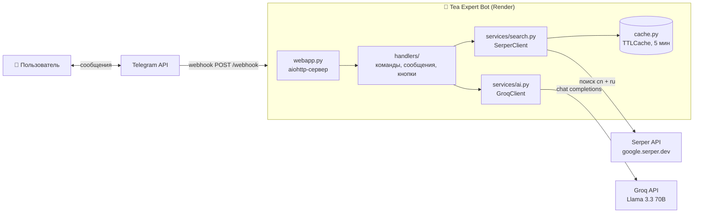
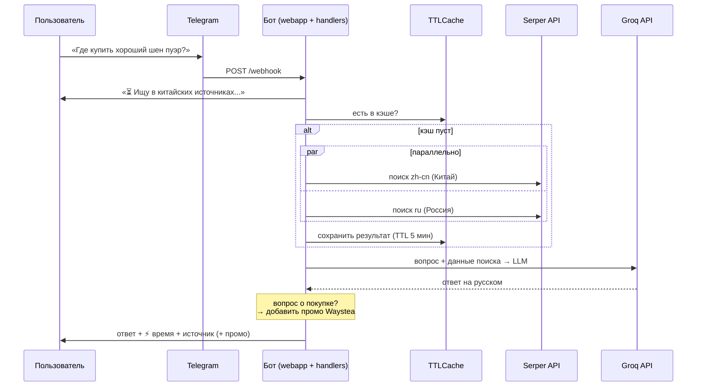
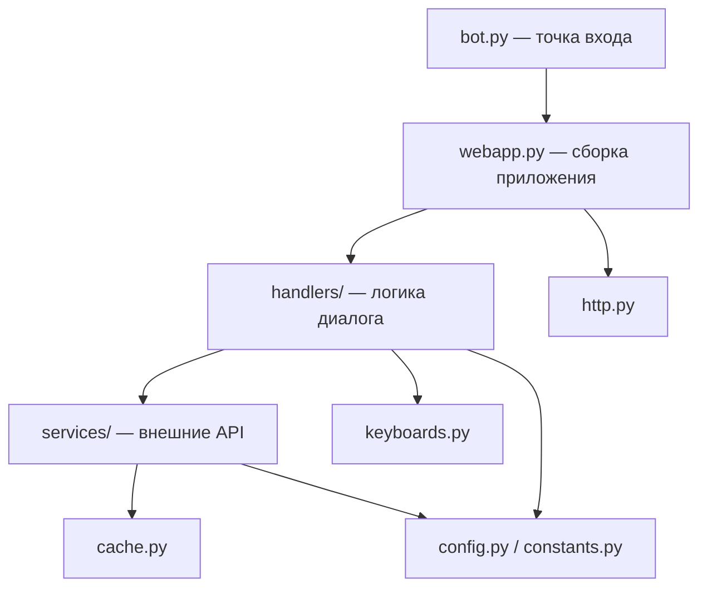
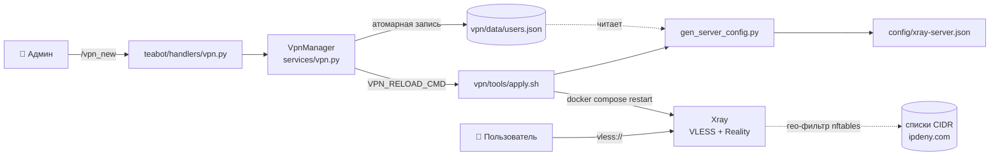
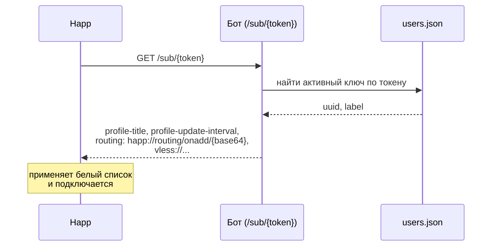

# 🍵 Tea Expert Bot — Архитектура

Telegram-бот, отвечающий на вопросы о китайском чае. Ищет актуальную информацию в китайских и российских источниках (Serper API), генерирует ответы с помощью LLM (Groq, Llama 3.3 70B) и рекомендует магазин **Waystea** при вопросах о покупке.

## Содержание

1. [Общая схема](#общая-схема)
2. [Поток обработки запроса](#поток-обработки-запроса)
3. [Структура кода](#структура-кода)
4. [Описание модулей](#описание-модулей)
5. [Внешние зависимости](#внешние-зависимости)
6. [Переменные окружения](#переменные-окружения)
7. [Деплой](#деплой)
8. [Решения для масштабируемости](#решения-для-масштабируемости)
9. [Известные проблемы](#известные-проблемы)
10. [Дорожная карта масштабирования](#дорожная-карта-масштабирования)

---

## Общая схема



Бот работает в **webhook-режиме**: Telegram сам доставляет обновления HTTP-запросом на `/webhook`, поэтому не нужен постоянный long-polling и приложение хорошо подходит для платформ типа Render.

## Поток обработки запроса

Типовой сценарий — пользователь задаёт свободный вопрос о чае:



Дополнительные сценарии:

- **/start, «привет», «меню»** → главное меню с inline-кнопками.
- **Кнопки меню** (`brew`, `news` → `reg_*`, `ship`, `price`) → готовые китайскоязычные поисковые запросы + генерация ответа.
- **Режим «Цены»**: кнопка `price` ставит `user_data["mode"] = "price"`; следующее сообщение трактуется как название чая — поиск цены + промо Waystea.
- **/debug** → диагностика: заданы ли ключи, живы ли Groq и Serper.

## Структура кода

```
Yea-bot-/
├── bot.py                  # точка входа (~10 строк) — имя сохранено для Render
├── requirements.txt        # зависимости рантайма
├── requirements-dev.txt    # + pytest для разработки
├── ARCHITECTURE.md         # этот документ
├── teabot/                 # пакет приложения
│   ├── config.py           # Settings (env), константы тайм-аутов и кэша
│   ├── constants.py        # тексты, REGIONS, BUY_KEYWORDS, is_buy_question()
│   ├── cache.py            # TTLCache — кэш в памяти с TTL и лимитом размера
│   ├── http.py             # общая aiohttp.ClientSession на всё приложение
│   ├── services/
│   │   ├── search.py       # SerperClient — поиск (cn + ru параллельно) + кэш
│   │   ├── ai.py           # GroqClient — chat completions + health_check
│   │   ├── vpn.py          # VpnManager — выдача/отзыв ключей VLESS+Reality
│   │   ├── happ.py         # форматы клиента Happ: routing-профиль, подписка
│   │   ├── rules.py        # загрузка групп сервисов и страновых профилей
│   │   └── qr.py           # QR-код ссылки (опциональная зависимость)
│   ├── handlers/
│   │   ├── __init__.py     # register_handlers(), доступ к сервисам из bot_data
│   │   ├── commands.py     # /start, /debug, меню
│   │   ├── vpn.py          # /vpn, /vpn_new, /vpn_list, /vpn_revoke
│   │   ├── messages.py     # свободные вопросы, режим «цены», safe_edit
│   │   └── callbacks.py    # обработка inline-кнопок
│   ├── keyboards.py        # inline-клавиатуры
│   ├── subscription.py     # GET /sub/{token} — подписка для Happ и др. клиентов
│   └── webapp.py           # сборка: PTB Application + aiohttp, webhook, lifecycle
├── tests/                  # unit-тесты (без сети)
├── vpn/                    # VPN-подсистема, см. vpn/README.md
│   ├── docker-compose.yml  # Xray (VLESS + Reality)
│   ├── config/profiles/    # страновые профили маршрутизации (ru, ir, by, cn)
│   ├── data/services.json  # группы иностранных сервисов для whitelist
│   └── tools/              # install.sh, geofw.sh, генераторы конфигов
└── .github/workflows/main.yml  # ⚠️ см. «Известные проблемы»
```

### Слои и правило зависимостей



Зависимости направлены сверху вниз: обработчики знают о сервисах, но сервисы ничего не знают о Telegram. Это позволяет тестировать сервисы и утилиты изолированно и заменять реализацию (например, кэш на Redis) без правок обработчиков.

## Описание модулей

| Модуль | Ответственность | Ключевые объекты |
|---|---|---|
| `teabot/config.py` | Чтение окружения, параметры моделей/тайм-аутов | `Settings.from_env()`, `Settings.validate()` |
| `teabot/constants.py` | Пользовательские тексты и справочники | `WAYSTEA_PROMO`, `REGIONS`, `is_buy_question()` |
| `teabot/cache.py` | Кэш в памяти | `TTLCache(ttl=300, max_size=200)` |
| `teabot/http.py` | Жизненный цикл общей HTTP-сессии | `create_session()`, `close_session()` |
| `teabot/services/search.py` | Поиск Serper: китайские + российские источники параллельно, кэширование | `SerperClient.search_china()`, `.health_check()` |
| `teabot/services/ai.py` | Генерация ответов Groq (Llama 3.3 70B), обработка 429/401/таймаутов | `GroqClient.ask()`, `.health_check()` |
| `teabot/services/vpn.py` | Ключи VPN: JSON-хранилище, `vless://`-ссылки, перезапуск Xray | `VpnManager.issue()`, `.revoke()`, `VpnServer.link()` |
| `teabot/services/happ.py` | Форматы Happ: routing-профиль, deep link, тело и заголовки подписки | `build_routing_profile()`, `routing_deeplink()`, `subscription_body()` |
| `teabot/services/rules.py` | Общие загрузчики групп сервисов и страновых профилей | `load_services()`, `load_profile()`, `collect_domains()` |
| `teabot/subscription.py` | Эндпоинт подписки `/sub/{token}` | `handle_subscription()`, `build_routing_link()` |
| `teabot/handlers/` | Диалоговая логика: команды, сообщения, кнопки | `register_handlers()`, `on_msg`, `on_cb` |
| `teabot/keyboards.py` | Разметка inline-клавиатур | `main_menu_kb()`, `regions_kb()` |
| `teabot/webapp.py` | Сборка и запуск: PTB + aiohttp, webhook, startup/shutdown | `create_app()`, `main()` |

### Внедрение зависимостей

Клиенты сервисов создаются один раз при старте (`webapp.on_startup`) и кладутся в `bot_data` PTB-приложения. Обработчики получают их через `get_search(ctx)` / `get_ai(ctx)` — глобальных переменных с состоянием нет, в тестах клиенты легко подменяются моками.

## Внешние зависимости

| Сервис | Назначение | Протокол |
|---|---|---|
| **Telegram Bot API** | Приём/отправка сообщений | Webhook (входящие) + HTTPS (исходящие), библиотека `python-telegram-bot` |
| **Groq API** | LLM-генерация ответов (`llama-3.3-70b-versatile`) | OpenAI-совместимый REST, тайм-аут 30 с |
| **Serper API** | Поиск Google (zh-cn и ru локали) | REST, тайм-аут 8 с, результаты кэшируются на 5 мин |
| **Render** | Хостинг, даёт `RENDER_EXTERNAL_URL` и `PORT` | — |

## Переменные окружения

| Переменная | Обязательна | Описание |
|---|---|---|
| `TELEGRAM_BOT_TOKEN` | ✅ да | Токен бота от @BotFather; без него приложение не стартует |
| `GROQ_API_KEY` | нет | Ключ Groq; без него бот отвечает заглушкой «AI отключён» |
| `SERPER_KEY` | нет | Ключ Serper; без него поиск пропускается, ответ строится только на знаниях LLM |
| `RENDER_EXTERNAL_URL` | нет | Публичный URL для webhook (Render задаёт автоматически) |
| `PORT` | нет | Порт HTTP-сервера, по умолчанию 8080 (Render задаёт автоматически) |
| `VPN_HOST`, `VPN_PORT` | нет | Адрес VPN-сервера; без `VPN_HOST` VPN-команды отвечают «не настроен» |
| `REALITY_PUBLIC_KEY`, `REALITY_SNI`, `REALITY_SHORT_IDS` | нет | Параметры Reality для `vless://`-ссылок (см. `vpn/.env.example`) |
| `VPN_ADMINS` | нет | ID администраторов через запятую — кому разрешено выдавать ключи |
| `VPN_USERS_PATH` | нет | Путь к `users.json`, по умолчанию `vpn/data/users.json` |
| `VPN_RELOAD_CMD` | нет | Команда применения конфига на VPN-ноде (`vpn/tools/apply.sh`) |
| `VPN_PROFILE` | нет | Профиль маршрутизации, который уходит в подписку, по умолчанию `ru` |
| `VPN_SUB_TITLE` | нет | Имя подписки в клиенте, по умолчанию `VPN` (Happ обрезает до 25 символов) |

## Деплой

- **Платформа**: Render (web service). Команда запуска — `python bot.py` (не менялась при рефакторинге).
- **Старт**: `webapp.main()` валидирует настройки → собирает приложение → на `on_startup` создаёт HTTP-сессию и клиентов, инициализирует PTB и регистрирует webhook `{RENDER_EXTERNAL_URL}/webhook`.
- **Остановка**: `on_shutdown` останавливает PTB и закрывает HTTP-сессию.

## VPN-подсистема

Отдельный контур в каталоге `vpn/`: он не зависит от бота и разворачивается на
своём сервере. Бот — только интерфейс выдачи ключей.



### Подписка для клиента

`GET /sub/{token}` на том же aiohttp-сервере, что и webhook. Клиент опрашивает
адрес раз в 12 часов и получает ключ вместе с правилами маршрутизации, так что
при отзыве ключа или правке белого списка ничего переустанавливать не нужно.



Формат — по [документации Happ](https://www.happ.su/main/dev-docs/): параметры
идут и в HTTP-заголовках, и строками тела с префиксом `#`, потому что часть
клиентов читает только тело. Routing-профиль собирается один раз при старте:
у него есть поле `LastUpdated`, и пересборка на каждый запрос заставляла бы
клиент постоянно перекачивать гео-базы.

Токен подписки (`sub_token`) хранится в записи ключа отдельно от `uuid` — адрес
подписки можно сменить, не выпуская новый ключ. Неизвестный и отозванный токен
дают одинаковый 404, чтобы перебор не отличал одно от другого.

Два независимых «белых списка»:

1. **Split tunnel по доменам (клиент).** `gen_client_config.py` собирает
   маршрутизацию из групп сервисов (`data/services.json`) и странового профиля
   (`config/profiles/*.json`): иностранные сервисы — в туннель, локальные
   домены и `geoip` страны — напрямую. Последнее правило конфига — «всё
   остальное напрямую», поэтому список именно белый.
2. **Гео-фильтр по странам (сервер).** `geofw.sh` строит в nftables наборы
   CIDR разрешённых стран и открывает порт VPN только для них. Правила
   ограничены портом VPN, поэтому потерять SSH-доступ нельзя.

Для Happ первый список отдаётся готовым профилем: `GlobalProxy: "false"` делает
выходом по умолчанию direct, а в туннель уходит только то, что перечислено в
`ProxySites`.

Ключи хранятся в JSON с блокировкой и атомарной подменой файла; отозванные
записи помечаются `revoked`, а не удаляются. Xray не перечитывает конфиг на
лету — после каждого изменения контейнер перезапускается.

Подробности, установка и разбор проблем — `vpn/README.md`.

## Решения для масштабируемости

Что уже сделано в текущей архитектуре:

1. **Одна `aiohttp.ClientSession` на приложение** вместо новой сессии на каждый запрос — переиспользование TCP/TLS-соединений, меньше накладных расходов и дескрипторов под нагрузкой.
2. **Параллельный поиск** — китайский и русский запросы к Serper выполняются через `asyncio.gather`, этап поиска ускорен примерно вдвое.
3. **Кэш поиска (TTLCache)** — повторные вопросы в течение 5 минут не тратят квоту Serper и отвечают быстрее; вынесен в отдельный класс, интерфейс `get/set` позволяет заменить на Redis без правок сервисов.
4. **Слоистая структура + DI** — новые команды/кнопки добавляются файлом в `handlers/`, новые внешние сервисы — классом в `services/`; ничего не нужно править в одном большом файле.
5. **Webhook вместо polling** — нагрузку создаёт только реальный трафик; несколько инстансов за балансировщиком смогут делить поток обновлений (после выноса состояния, см. roadmap).
6. **Тесты без сети** (`tests/`) — кэш, определение «вопроса о покупке», конфигурация; фундамент для безопасных изменений.

Текущие ограничения:

- **Кэш и `user_data` живут в памяти процесса** → при рестарте теряются; при нескольких инстансах не разделяются. Это главный блокер горизонтального масштабирования.
- **Нет rate limiting** на пользователя — злоупотребление может исчерпать квоты Groq/Serper.
- **Обработка обновления синхронна внутри HTTP-запроса** — Telegram ждёт ответ `/webhook`, пока выполняются поиск и LLM (до ~40 с в худшем случае).

## Известные проблемы

- **`.github/workflows/main.yml` («Daily Tea Digest») не работает по назначению**: по расписанию он запускает `python bot.py`, т.е. поднимает webhook-сервер прямо на CI-раннере, который висит до принудительного завершения задачи. Никакого «дайджеста» в коде нет. Кроме того, workflow передаёт секрет `FIREWORKS_KEY`, который нигде не используется (актуальный ключ — `GROQ_API_KEY`). Workflow либо нужно удалить, либо написать для него отдельный скрипт рассылки дайджеста.

## Дорожная карта масштабирования

Этапы описаны от дешёвых к дорогим; каждый следующий имеет смысл при росте нагрузки.

### Этап 2 — вынос состояния (при заметном трафике)

- **Redis** вместо `TTLCache` и для `user_data` (режим «цены»): состояние переживает рестарты и разделяется между инстансами → можно запускать 2+ копии бота за балансировщиком Render.
- **Rate limiting** на пользователя (например, N запросов/мин через тот же Redis) — защита квот Groq/Serper.
- **PostgreSQL/SQLite** для статистики: журнал вопросов, популярные темы, конверсия промо Waystea.
- Быстрый ответ webhook: подтверждать запрос Telegram сразу, обработку выполнять в `asyncio.create_task` с ограничением одновременных задач (`Semaphore`).

### Этап 3 — очереди и разделение сервисов (при высокой нагрузке)

- Очередь задач (например, Redis + arq/celery): webhook-приёмник только кладёт обновление в очередь, воркеры выполняют поиск и LLM-генерацию; приёмник и воркеры масштабируются независимо.
- Отдельный сервис-планировщик для рассылок (настоящий «Daily Tea Digest»).
- Метрики и алёрты (время ответа, ошибки внешних API, расход квот).
