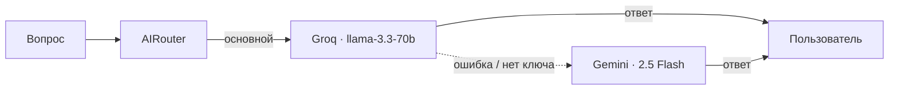

# 🧠 Два мозга бота: Groq + Gemini

Бот работает на двух моделях. Основная отвечает первой, вторая
подстраховывает: если основная вернула ошибку — нет ключа, rate limit,
таймаут, пустой ответ — тот же вопрос автоматически уходит запасной,
и пользователь получает нормальный ответ вместо «AI недоступен».

Подстраховка работает везде, где бот обращается к AI: свободные вопросы,
кнопки меню, поиск цен и ответы в соцсетях.

## Настройка

| Переменная | По умолчанию | Описание |
|---|---|---|
| `GROQ_API_KEY` | — | Ключ Groq (console.groq.com) |
| `GEMINI_API_KEY` | — | Ключ Google Gemini (aistudio.google.com/apikey) |
| `GEMINI_MODEL` | `gemini-2.5-flash` | Модель Gemini |
| `AI_PRIMARY` | `groq` | Какой мозг отвечает первым: `groq` или `gemini` |

Хватает ключа любого одного мозга — второй просто не используется.
Оба ключа дают отказоустойчивость.

## Команды

| Команда | Что делает |
|---|---|
| `/brain` | Показывает оба мозга, их модели и статус; ⭐ — основной |
| `/brain gemini` | Делает Gemini основным (до перезапуска бота) |
| `/second <вопрос>` | Задаёт вопрос запасному мозгу — второе мнение для сравнения |
| `/debug` | Диагностика: статус обоих мозгов и поиска |

## Как устроено

- `teabot/services/gemini.py` — `GeminiClient` с тем же интерфейсом, что у
  `GroqClient`: `ask(prompt, system="")` и `health_check()`.
- `teabot/services/router.py` — `AIRouter` выбирает мозг и переключается
  на запасной. Для обработчиков он выглядит как обычный AI-клиент,
  поэтому остальной код о втором мозге ничего не знает.
- Ошибкой считается ответ, начинающийся с `⚠️` (клиенты не бросают
  исключения, а возвращают понятный текст) — см. `is_error_answer()`.
- У моделей Gemini 2.5 «размышления» отключены (`thinkingBudget: 0`):
  иначе они съедают лимит токенов и ответ приходит пустым.

## Добавить третий мозг

1. Создайте клиент с методами `ask(prompt, system="")` и `health_check()`,
   атрибутами `name`, `model`, `available`.
2. Добавьте его в словарь `AIRouter` в `teabot/webapp.py`.

Роутер переберёт мозги по порядку: основной, затем первый доступный из
остальных. Ни обработчики, ни хаб соцсетей менять не нужно.
