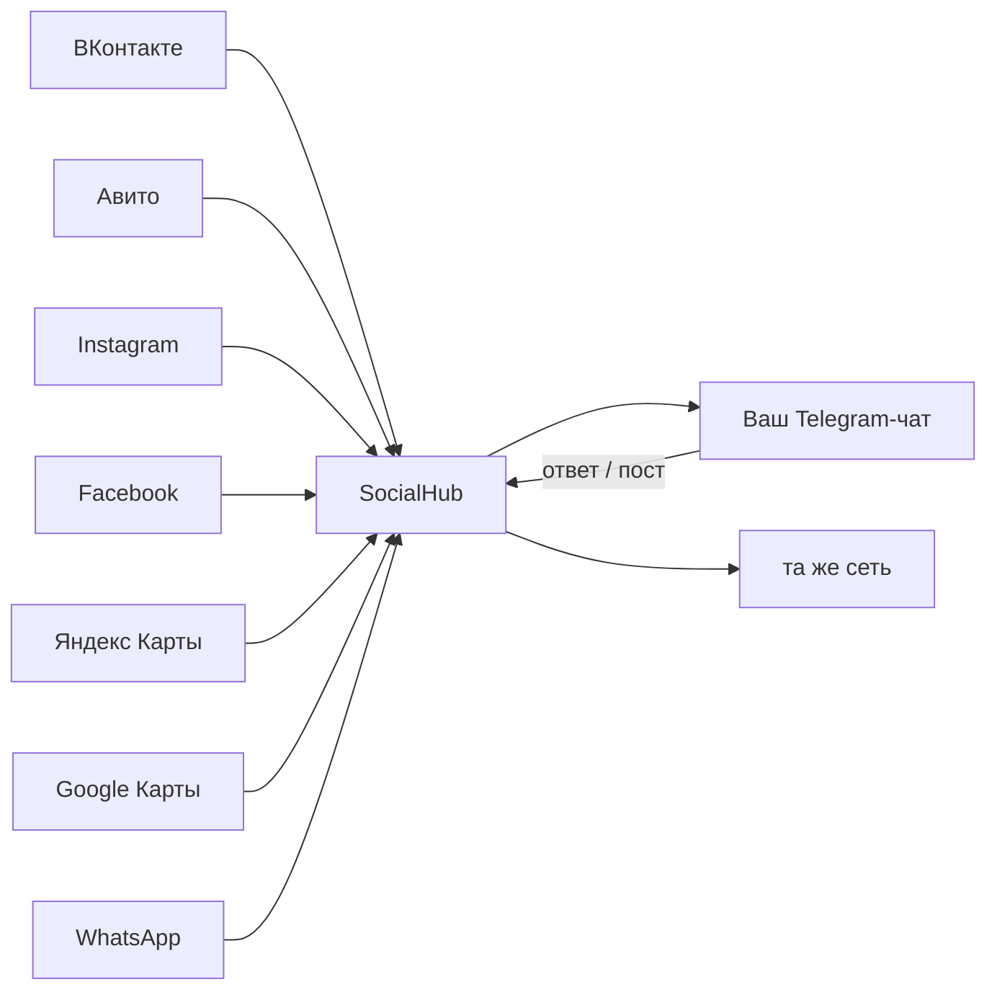

# 🌐 Единый центр соцсетей

Все площадки бизнеса — в одном Telegram-чате: сообщения, комментарии и отзывы
приходят сюда сами, ответить можно кнопкой или отдать это ИИ, а пост
публикуется сразу во все сети одной командой.

- [Как это работает](#как-это-работает)
- [Команды](#команды)
- [Автопилот](#автопилот)
- [Подключение площадок](#подключение-площадок)
- [Что умеет каждая площадка](#что-умеет-каждая-площадка)
- [Добавить новую сеть](#добавить-новую-сеть)

## Как это работает

1. Фоновая задача каждые `SOCIAL_POLL_INTERVAL` секунд (по умолчанию 180)
   опрашивает все настроенные площадки.
2. Уже показанное отсеивается по `SeenStore`, новое приходит карточкой
   в чат `SOCIAL_ADMIN_CHAT_ID`.
3. Под карточкой — кнопки: **🤖 Ответить ИИ**, **✍️ Свой ответ**, **✅ Прочитано**.
   Ответ уходит обратно в ту же сеть тем же коннектором.
4. Сбой одной площадки не мешает остальным: ошибка попадает в панель `/social`.

Ни один ключ не хранится в коде — только в переменных окружения.
Площадка включается сама, как только её переменные заданы.

## Команды

| Команда | Что делает |
|---|---|
| `/social` | Панель: какие сети подключены, статус автопилота, ошибки |
| `/inbox` | Опросить все сети прямо сейчас и показать новое |
| `/post <текст>` | Кросспостинг во все сети, которые умеют публиковать (с подтверждением) |
| `/autopilot on` / `off` | Включить или выключить автономные ответы |

Управление доступно только из чата `SOCIAL_ADMIN_CHAT_ID`. Пока он не задан,
команды работают в любом чате, а `/social` показывает ID текущего чата —
его и нужно прописать в переменные окружения.

## Автопилот

При `SOCIAL_AUTOPILOT=on` бот сам пишет ответ и отправляет его в сеть,
а в чат кладёт отчёт «что пришло → что ответили». Ответ готовит основной
мозг, при его сбое — запасной (см. [docs/AI.md](AI.md)).

Исключение: **негативные отзывы** (оценка ниже 4) автопилот не трогает —
такая карточка приходит с пометкой «Нужен ваш ответ». Порог задан
константой `AUTOPILOT_MIN_RATING` в `teabot/social/hub.py`.

Роль модели для соцсетей описана в `REPLY_SYSTEM_PROMPT` там же: отвечать
от лица магазина, коротко, без выдуманных цен и обещаний скидок.

## Подключение площадок

### Общие настройки

| Переменная | По умолчанию | Описание |
|---|---|---|
| `SOCIAL_ADMIN_CHAT_ID` | — | Чат, куда стекается всё и откуда разрешено управление. Без него автономный опрос выключен |
| `SOCIAL_POLL_INTERVAL` | `180` | Период опроса площадок, секунды (минимум 30) |
| `SOCIAL_AUTOPILOT` | `off` | `on` — отвечать автоматически |
| `SOCIAL_STATE_PATH` | `/tmp/teabot_social_seen.json` | Файл памяти о показанных элементах |

### ВКонтакте

| Переменная | Где взять |
|---|---|
| `VK_GROUP_TOKEN` | Управление сообществом → Работа с API → ключ доступа с правами **сообщения** и **стена** |
| `VK_GROUP_ID` | Числовой id сообщества (нужен для постов на стену) |

Включите в сообществе «Сообщения» и «Возможность писать боту».

### Telegram-канал

| Переменная | Где взять |
|---|---|
| `TELEGRAM_BOT_TOKEN` | Тот же токен бота |
| `TELEGRAM_CHANNEL_ID` | `@username` канала или `-100...`; бот должен быть админом канала |

### Одноклассники

| Переменная | Где взять |
|---|---|
| `OK_APP_KEY`, `OK_APP_SECRET` | ok.ru/dk?st.cmd=appsInfoMyDevList — данные приложения |
| `OK_ACCESS_TOKEN` | Токен пользователя с правом `VALUABLE_ACCESS` и `PUBLISH_TO_STREAM` |
| `OK_GROUP_ID` | Id группы для публикаций |

### Facebook и Instagram (Meta)

| Переменная | Где взять |
|---|---|
| `FB_PAGE_ID`, `FB_PAGE_TOKEN` | Meta for Developers → токен страницы с `pages_messaging`, `pages_manage_posts` |
| `IG_USER_ID`, `IG_TOKEN` | Instagram Business аккаунт, связанный со страницей; права `instagram_manage_comments` |

### WhatsApp Business

| Переменная | Где взять |
|---|---|
| `WA_PHONE_ID`, `WA_TOKEN` | WhatsApp Cloud API: id номера и постоянный токен |

Входящие WhatsApp приходят на webhook Meta, а не по запросу, поэтому
опрос для этой площадки не выполняется — доступна отправка и ответ.

### Авито

| Переменная | Где взять |
|---|---|
| `AVITO_CLIENT_ID`, `AVITO_CLIENT_SECRET` | Личный кабинет → Настройки → API |
| `AVITO_USER_ID` | Числовой id профиля Авито |

### Яндекс Карты (Яндекс Бизнес)

| Переменная | Где взять |
|---|---|
| `YANDEX_BUSINESS_TOKEN` | OAuth-токен владельца организации |
| `YANDEX_COMPANY_ID` | Id организации в Яндекс Бизнесе |
| `YANDEX_API_URL` | Необязательно: базовый адрес API, если вам выдали другой (по умолчанию `https://api.business.yandex.ru/v1`) |

Доступ к API отзывов выдаётся владельцу организации отдельно. Базовый адрес
вынесен в переменную специально: если в вашей версии API путь отличается,
хватит правки окружения без изменения кода.

### Google Карты (Google Business Profile)

| Переменная | Где взять |
|---|---|
| `GOOGLE_CLIENT_ID`, `GOOGLE_CLIENT_SECRET` | Google Cloud Console → OAuth client |
| `GOOGLE_REFRESH_TOKEN` | Refresh-токен владельца карточки (scope `business.manage`) |
| `GOOGLE_LOCATION` | Имя локации вида `accounts/123/locations/456` |

Access-токен обновляется автоматически и кэшируется до истечения.

## Что умеет каждая площадка

| Площадка | Чтение | Ответы | Посты |
|---|:---:|:---:|:---:|
| ВКонтакте | ✅ | ✅ | ✅ |
| Telegram-канал | — | — | ✅ |
| Одноклассники | — | — | ✅ |
| Facebook (страница) | ✅ | ✅ | ✅ |
| Instagram | ✅ (комментарии) | ✅ | — (нужен медиафайл) |
| WhatsApp Business | — (webhook) | ✅ | — |
| Авито | ✅ | ✅ | — |
| Яндекс Карты | ✅ (отзывы) | ✅ | — |
| Google Карты | ✅ (отзывы) | ✅ | — |

Прочерк — ограничение самой платформы, а не бота: хаб просто не вызывает
операцию, которой у сети нет.

## Добавить новую сеть

1. Создайте `teabot/social/connectors/<сеть>.py` с классом-наследником
   `HttpConnector`: задайте `network`, `title`, `capabilities`, `required_env`
   и реализуйте только то, что площадка умеет (`fetch`, `reply`, `publish`).
2. Добавьте класс в `SPECS` в `teabot/social/registry.py` — там же
   перечислены переменные окружения.
3. Добавьте строку в таблицу выше.

Ни хаб, ни обработчики править не нужно: они работают через общий контракт.
