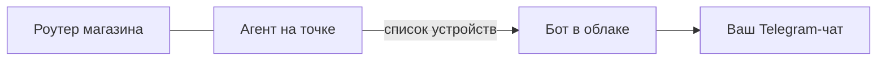

# 📶 Контроль рабочих сетей Wi-Fi

Бот следит за тем, **кто подключается к сетям магазинов**, и пишет в тот
же чат, что и соцсети: появилось новое устройство — карточка с адресом,
именем и временем. Особо помечаются подключения в нерабочие часы.

- [Что это даёт, а что нет](#что-это-даёт-а-что-нет)
- [Как устроено](#как-устроено)
- [Настройка](#настройка)
- [Команды](#команды)
- [Что делать с предупреждением](#что-делать-с-предупреждением)

## Что это даёт, а что нет

**Даёт:**

- новое устройство в рабочей сети — сразу видно;
- подключение ночью, когда магазин закрыт;
- устройство, которого не было больше суток, вернулось;
- список всех устройств по каждой точке в любой момент (`/wifi`).

**Не даёт, и это важно понимать:**

- ❌ **не видит содержимое трафика.** Современный трафик зашифрован;
  «посмотреть, что человек передаёт» без взлома шифрования невозможно.
- ❌ **не ловит утечку данных саму по себе.** Утечка — это когда данные
  уходят наружу легальным каналом: через браузер, почту, мессенджер,
  флешку. Список подключений этого не покажет.
- ❌ **не заменяет защиту сети.** Разделение на сети, пароли, права
  доступа, обновления роутера — отдельная работа.

Что здесь есть на самом деле — это контроль доступа: чужое устройство в
одной сети с кассой видно сразу. Для магазина это закрывает самый частый
риск: к рабочему Wi-Fi подключились те, кому не следовало.

## Как устроено



Бот живёт в облаке и за роутер магазина заглянуть не может — это не
ограничение кода, а устройство сети. Поэтому на точке работает агент:
маленький скрипт на любом компьютере или мини-ПК в той же сети. Он
опрашивает соседей по сети (ARP-таблица) и отправляет боту список.

Агент **не трогает трафик и пароли** — только «кто в сети».

## Настройка

### Бот

| Переменная | Зачем |
|---|---|
| `WIFI_AGENT_TOKEN` | Общий секрет агента и бота. Без него точка приёма отключена |
| `WIFI_STATE_PATH` | Файл реестра устройств (по умолчанию во временной папке) |

### Агент на точке

```bash
export WIFI_AGENT_TOKEN=тот-же-секрет
export WIFI_BRANCH=gagarina            # или gastromarket, cheryomushki
export WIFI_ENDPOINT=https://ваш-бот/security/wifi

python3 scripts/wifi_agent.py          # разовая проверка
python3 scripts/wifi_agent.py --watch  # каждые 5 минут
```

Чтобы агент поднимался сам, поставьте его в автозапуск: на Mac —
launchd, на Linux — systemd или cron, на Windows — планировщик задач.
Подойдёт любой компьютер, который и так стоит в магазине.

По одному агенту на точку: у каждой свой `WIFI_BRANCH`.

## Команды

| Команда | Что делает |
|---|---|
| `/wifi` | Список устройств по точкам: сколько всего, кто не помечен своим, когда агент выходил на связь |
| `/wifi trust AA:BB:CC:DD:EE:FF Касса` | Пометить устройство своим — о нём больше не предупреждаем |
| `/wifi forget AA:BB:CC:DD:EE:FF` | Забыть устройство: в следующий раз придёт как новое |

Первые дни новых устройств будет много — это нормально: бот знакомится с
сетью. Помечайте свои (`trust`), и поток быстро сойдёт к настоящим
новостям.

## Что делать с предупреждением

Пришло «новое устройство»:

1. **Узнали его** (телефон сотрудника, новый терминал) — `/wifi trust`
   с понятным именем.
2. **Не узнали, магазин работает** — скорее всего гость подключился к
   рабочей сети. Значит, гостям нужна отдельная гостевая сеть с
   изоляцией: тогда они не окажутся в одной сети с кассой.
3. **Не узнали, магазин закрыт** — это повод разбираться: сменить
   пароль Wi-Fi, проверить, кто имеет к нему доступ, посмотреть журнал
   роутера.

Отдельно стоит сделать один раз, без всякой автоматики: развести
рабочую и гостевую сети, сменить пароль администратора роутера,
выключить WPS и удалённый доступ к роутеру из интернета, включить
обновления прошивки.
