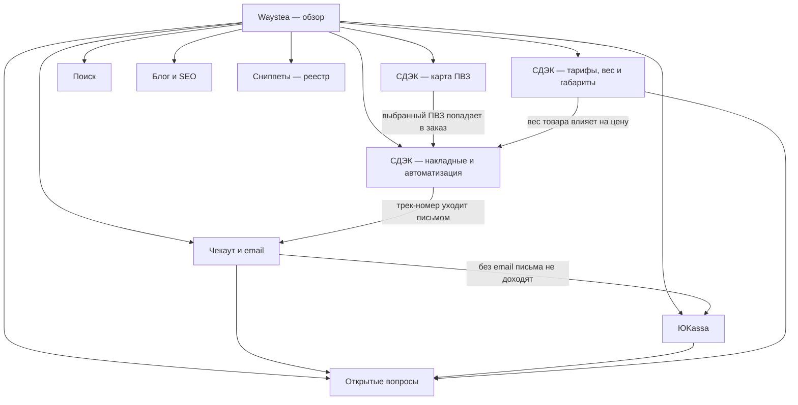

# База знаний Waystea

Хранилище Obsidian: откройте папку `knowledge` как vault — связи `[[...]]`
построят граф. На GitHub схема ниже рендерится сама.

Здесь фиксируется работа по сайту **waystea.ru** (WooCommerce): в чём была
причина проблемы, чем это доказано, что изменено и где лежит правка.

> Секреты (пароли, ключи API) сюда не пишутся. Только где они лежат.

## Карта связей

## Точки входа

- [[Waystea — обзор]]
- [[Открытые вопросы]] — что не закрыто
- [[Сниппеты — реестр]] — где что лежит
