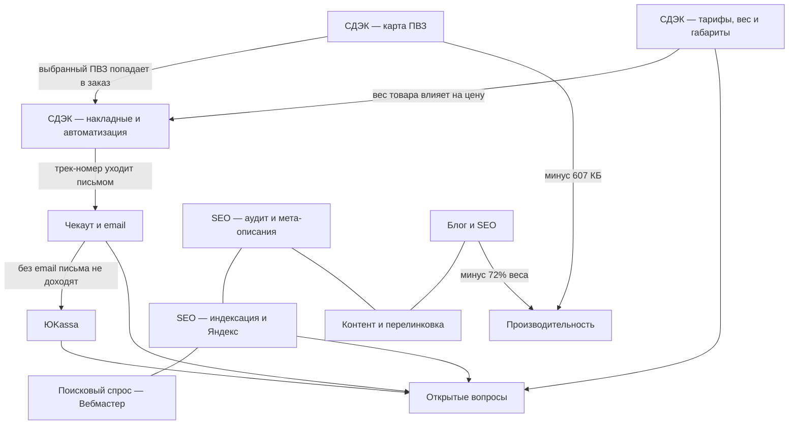

# Waystea — обзор

> Заметки восстановлены из транскрипта сессии 26 июля — 3 августа 2026.
> Ранняя часть (SEO, индексация, контент) описана короче: она реконструирована
> по итоговым сообщениям, без полной цепочки замеров.

Интернет-магазин чая **waystea.ru**. WordPress + WooCommerce.

## Ключевые факты

- Доставка: плагин **CDEKDelivery 5.0.0**, отправка из Владимира (код города 94).
- Оплата: **ЮKassa** (`yookassa_epl`) и «оператор свяжется» (`cod`).
- Поиск: **Advanced Woo Search 3.66**.
- Тема: Hello Elementor + дочерняя, конструктор Elementor.
- Правки вносятся через плагин **Code Snippets**, файлы темы и плагинов не трогаются —
  так изменения переживают обновления.

## Карта связей

## Разделы

- [[СДЭК — карта ПВЗ]]
- [[СДЭК — накладные и автоматизация]]
- [[СДЭК — тарифы, вес и габариты]]
- [[Чекаут и email]]
- [[ЮKassa]]
- [[Поиск]]
- [[Блог и SEO]]
- [[SEO — аудит и мета-описания]]
- [[SEO — индексация и Яндекс]]
- [[Поисковый спрос — Вебмастер]]
- [[Контент и перелинковка]]
- [[Производительность]]
- [[Сниппеты — реестр]]
- [[Открытые вопросы]]

## Доступы: где они живут

Контейнер эфемерный. Всё, что выдано в чате, живёт одну сессию — включая пароль
приложения WordPress и OAuth-токен Яндекса. Единственное место, которое переживает
пересоздание контейнера, — **переменные окружения Claude Code** (окружение Default).

Ожидаемые имена переменных (хук `.claude/hooks/credentials-check.sh` проверяет их
на старте каждой сессии и сообщает, чего не хватает):

| Переменная | Для чего | Где взять |
|---|---|---|
| `WAYSTEA_WP_APP_PASSWORD` | правки сайта через REST API WordPress | WP-админка → Пользователи → профиль → Пароли приложений |
| `YANDEX_OAUTH_TOKEN` | Вебмастер и Метрика | oauth.yandex.ru, права на оба сервиса |
| `YANDEX_METRIKA_COUNTER` | номер счётчика | для waystea.ru — 84628927 |

Сами значения в репозиторий не пишутся — только эта таблица.

> Урок сессии 18.08.2026: я попросил у владельца токен Вебмастера, хотя рабочий
> токен лежал в истории той же сессии. Прежде чем просить ключ — искать его
> в переменных окружения, в файлах сессии и в её истории.
