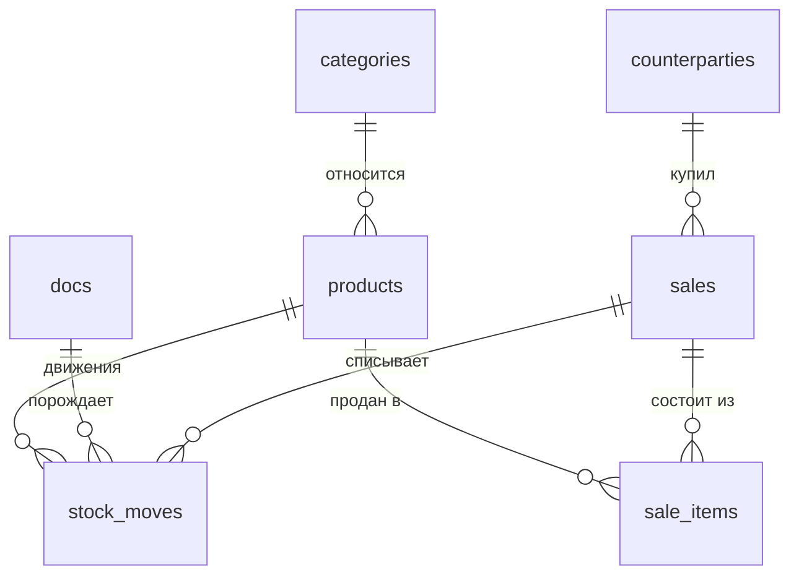

# 📦 Склад — учёт товаров и продаж

Мобильное приложение для iOS и Android: каталог товаров, приход и списание,
касса со сканером штрихкодов, отчёты по выручке и прибыли. Аналог CloudShop,
только свой и без абонентской платы.

Работает полностью **офлайн**: все данные лежат в SQLite на самом телефоне,
интернет нужен только для выгрузки CSV кому-то наружу.

---

## Содержание

1. [Что умеет](#что-умеет)
2. [Как запустить у себя](#как-запустить-у-себя)
3. [Как выпустить в App Store и Google Play](#как-выпустить-в-app-store-и-google-play)
4. [Устройство приложения](#устройство-приложения)
5. [Модель данных](#модель-данных)
6. [Ключевые решения](#ключевые-решения)
7. [Проверки](#проверки)
8. [Что дальше](#что-дальше)

---

## Что умеет

**Товары**
- Карточка: название, категория, артикул, штрихкод, единица измерения, фото
- Две цены — закупочная и розничная, прибыль считается автоматически
- Порог «заканчивается» для каждого товара
- Поиск по названию, артикулу и штрихкоду (в том числе по-русски)
- Архив вместо удаления — история продаж не рушится

**Склад**
- Приход от поставщика: остаток растёт, закупочная цена обновляется
- Списание: брак, бой, недостача
- Инвентаризация: ввели фактический остаток — разница ушла в историю
- История движений по каждому товару: видно, откуда взялся текущий остаток

**Касса**
- Товар в чек — сканером или из списка
- Дробное количество: чай продаётся на вес (0,05 кг)
- Скидка суммой или процентом на весь чек
- Оплата наличными, картой или переводом
- Возврат чека: товар возвращается на склад

**Клиенты и поставщики**
- Справочник в разделе «Меню»: имя, телефон, почта, личная скидка, заметка
- Поиск по имени и по телефону в любом написании: `+7 999…` и `8 (999) …` — один человек
- Сумма покупок и число чеков в карточке
- Загрузка готовой базы из выгрузки другой программы без дублей

**Отчёты**
- Выручка, прибыль, количество чеков, средний чек за период
- График выручки по дням
- Топ товаров по выручке и прибыли
- Список «пора закупить»
- Стоимость склада в закупочных и розничных ценах
- Выгрузка остатков в CSV (открывается в Excel)

---

## Как запустить у себя

Нужен установленный [Node.js 20+](https://nodejs.org).

```bash
cd warehouse
npm install --legacy-peer-deps
npx expo start
```

В терминале появится QR-код.

**На телефоне** установите приложение **Expo Go**
([App Store](https://apps.apple.com/app/expo-go/id982107779) ·
[Google Play](https://play.google.com/store/apps/details?id=host.exp.exponent))
и отсканируйте QR-код — приложение откроется на телефоне. Правки в коде
подхватываются сразу, пересобирать ничего не нужно.

> ⚠️ Сканер штрихкодов в Expo Go работает, но камере нужен реальный телефон —
> в эмуляторе сканировать нечего.

Флаг `--legacy-peer-deps` нужен из-за расхождения версий peer-зависимостей
между `jest` и `ts-jest`; на работу приложения это не влияет.

### Посмотреть на компьютере, без телефона

```bash
npm run web
```

Соберёт приложение и откроет его по адресу `http://localhost:8080` — работает
как на телефоне, включая базу, кассу и отчёты. Удобно, чтобы проверить логику,
не воюя с Wi-Fi.

Сканер штрихкодов в браузере запросит доступ к веб-камере; на настольном
компьютере им обычно не пользуются — товары добавляются кнопкой «Выбрать товар».

Почему отдельный сервер, а не `expo start --web`: SQLite в браузере работает
через `SharedArrayBuffer`, а он доступен только на странице с заголовками
`Cross-Origin-Opener-Policy` и `Cross-Origin-Embedder-Policy`. Dev-сервер Expo
их не выставляет, поэтому собранная версия раздаётся своим маленьким сервером
(`scripts/serve-web.mjs`).

### Если телефон не видит компьютер

Expo Go подключается к компьютеру по локальной сети, и она часто не пускает:

1. **Разрешение macOS.** Системные настройки → Конфиденциальность и
   безопасность → **Локальная сеть** → включить для Терминала. Без этого
   телефон не достучится до Mac, хотя QR-код отображается нормально.
   После включения терминал нужно закрыть и открыть заново.
2. **Одна сеть.** IP телефона должен быть из той же подсети, что показывает
   Expo (`exp://192.168.0.22:8081` → у телефона тоже `192.168.0.x`).
3. **Туннель:** `npx expo start --tunnel` — соединение пойдёт через интернет
   в обход локальной сети. Зависит от доступности ngrok.
4. Если ничего не помогло — соберите установочный файл, см. ниже.

---

## Установочный файл без терминала

Когда нужно просто поставить приложение на телефон — без Expo Go, Wi-Fi
и запущенного компьютера. Сборка идёт на серверах Expo.

```bash
npm install -g eas-cli
eas login                        # нужен бесплатный аккаунт expo.dev
eas build --profile preview --platform android
```

На выходе — ссылка на `.apk`. Открываете её на Android-телефоне, разрешаете
установку из этого источника, приложение ставится как обычное. Профиль
`preview` для этого и заведён в `eas.json`.

Для iPhone тот же профиль даёт `.ipa`, но поставить его на устройство без
аккаунта Apple Developer (99 $ в год) нельзя — таковы правила Apple. Пока
аккаунта нет, на iPhone остаётся только Expo Go.

---

## Как выпустить в App Store и Google Play

Expo Go — только для разработки. Чтобы приложение стало «настоящим»:

1. **Заведите аккаунт Expo** и установите EAS CLI:
   ```bash
   npm install -g eas-cli
   eas login
   eas build:configure
   ```

2. **Соберите приложение** (сборка идёт на серверах Expo, Mac не нужен даже для iOS):
   ```bash
   eas build --platform android    # .aab для Google Play
   eas build --platform ios        # .ipa для App Store
   ```

3. **Отправьте в магазины**:
   ```bash
   eas submit --platform android
   eas submit --platform ios
   ```

Что понадобится помимо кода:
- аккаунт разработчика Apple — 99 $ в год
- аккаунт Google Play — 25 $ единоразово
- иконка и скриншоты (лежат в `assets/`, замените на свои)
- политика конфиденциальности — обязательна для обоих магазинов

Идентификаторы приложения уже прописаны в `app.json`
(`com.waystea.warehouse`) — поменяйте, если нужен другой.

---

## Устройство приложения

```
warehouse/
├── app/                      экраны (маршрут = путь к файлу, expo-router)
│   ├── _layout.tsx           провайдеры: база, корзина, сканер
│   ├── (tabs)/
│   │   ├── index.tsx         Главная: показатели, отчёты, оценка склада
│   │   ├── catalog.tsx       Каталог товаров
│   │   ├── journal.tsx       Журнал документов и чеков
│   │   └── menu.tsx          Меню: справочники, точка продаж, информация
│   ├── new.tsx               шторка «+»: что создать
│   ├── product/[id].tsx      карточка товара, инвентаризация, история
│   ├── counterparties.tsx    список клиентов или поставщиков
│   ├── counterparty/[id].tsx карточка клиента или поставщика
│   ├── doc/new.tsx           приход и списание
│   ├── sale/[id].tsx         чек и возврат
│   └── scan.tsx              сканер штрихкодов
├── src/
│   ├── domain/               чистая логика: деньги, количества, корзина
│   ├── db/                   схема, миграции, запросы, экспорт CSV
│   ├── state/                провайдеры базы, корзины и сканера
│   └── ui/                   тема и переиспользуемые компоненты
└── app.json                  конфигурация Expo, права доступа
```

Правило разделения: в `src/domain/` нет ни базы, ни React; в `src/db/` нет
React; экраны не считают деньги сами. Поэтому арифметика чеков и остатков
проверяется тестами без телефона.

---

## Модель данных



| Таблица | Зачем |
|---|---|
| `categories` | Категории товаров |
| `products` | Каталог: цены, штрихкод, единица, порог остатка |
| `stock_moves` | **Все** изменения остатка: приход, списание, продажа, возврат, пересчёт |
| `docs` | Документы прихода, списания, инвентаризации |
| `sales` / `sale_items` | Чеки и их позиции |
| `counterparties` | Клиенты и поставщики: телефон, почта, личная скидка |

**Остаток нигде не хранится числом.** Он всегда считается как
`SUM(stock_moves.qty_delta)` по товару. Из-за этого остаток невозможно
рассинхронизировать с историей, и на любой вопрос «почему тут 3 кг» есть ответ
в истории движений.

---

## Ключевые решения

**Деньги — целые копейки, количества — целые тысячные.**
Дробные рубли в JavaScript накапливают ошибку (`0.1 + 0.2 !== 0.3`), и на
длинной смене касса разойдётся с реальностью. Формат `1000 = 1 кг` заодно даёт
продажу на вес с точностью до грамма.

**Продажа в минус запрещена.**
Если остатка не хватает, чек не проводится. Иначе остаток перестаёт годиться
для заказа поставщику. Расхождения исправляются инвентаризацией — и попадают
в историю, а не растворяются в продажах.

**Остаток перепроверяется в момент оплаты, а не при добавлении в корзину.**
Между сканированием товара и нажатием «Оплатить» его могли списать другим
документом.

**Себестоимость фиксируется в чеке.**
`sale_items.cost_price` — копия закупочной цены на момент продажи. Поэтому
прошлые отчёты не меняются задним числом, когда приходит новая партия по
другой цене. Метод — по последней закупочной цене, не FIFO.

**Возврат не удаляет чек.**
Он пишет компенсирующие движения и обнуляет суммы чека. История остаётся,
выручка за период — честная.

**Отдельная колонка `search_text`.**
`LIKE` и `LOWER()` в SQLite игнорируют регистр только для латиницы: запрос
«улун» не нашёл бы товар «Улун». В колонке лежит `название + артикул + штрихкод`
в нижнем регистре, поиск идёт по ней.

**Тонкий интерфейс `SqlDriver`.**
В приложении под ним `expo-sqlite`, в тестах — `better-sqlite3`. Один и тот же
SQL, но логику склада можно гонять в Node — отсюда 77 тестов, которые не требуют
телефона.

---

## Проверки

```bash
npm test         # 77 тестов: арифметика чеков, остатки, отчёты, транзакции
npm run typecheck
```

Обе проверки запускаются автоматически на GitHub при изменениях в `warehouse/`
(`.github/workflows/warehouse.yml`).

Что покрыто тестами:
- округление денег и количеств, разбор пользовательского ввода
- итоги корзины, скидки, границы (скидка больше чека, отрицательная скидка)
- приход, списание, инвентаризация, откат документа при ошибке в середине
- запрет продажи сверх остатка, перепроверка остатка при оплате
- возврат и запрет повторного возврата
- выручка, прибыль, средний чек, топ товаров, стоимость склада, границы периодов
- клиенты: поиск по телефону в любом написании, загрузка базы без дублей

---

## Что дальше

Отсортировано по тому, что раньше понадобится в реальной работе:

1. **Резервная копия.** Сейчас данные живут только на телефоне: потеря телефона =
   потеря склада. Ближайший шаг — выгрузка всей базы в файл и восстановление из него.
2. **Несколько сотрудников.** Пока база локальная. Для двух продавцов нужен общий
   сервер и синхронизация — это отдельная большая работа.
3. **Печать чека** на bluetooth-принтере.
4. **Связь с ботом.** В этом же репозитории живёт Telegram-бот `teabot`. Он мог бы
   отвечать на «что есть в наличии» — для этого нужен общий источник остатков,
   то есть тот же сервер из пункта 2.
5. **Приход по фото накладной** — распознавание позиций.
